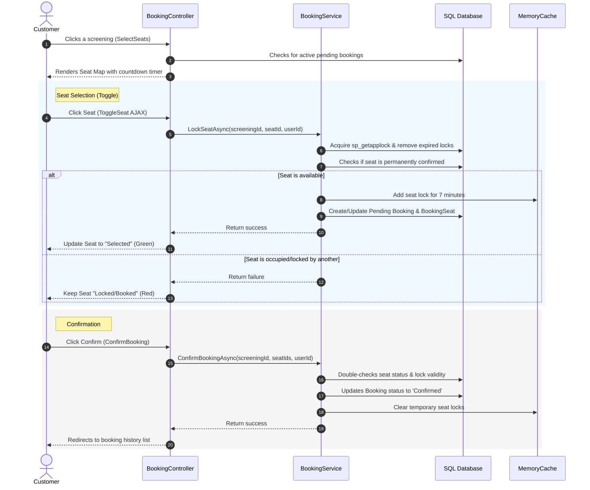

# CemaApp Project Guide

This guide provides an overview of the files in the CemaApp project, explaining what they do and how the application works.

---

## Core System Architecture

CemaApp is built on the **ASP.NET Core Model-View-Controller (MVC)** framework. It features a complete online cinema reservation workflow, separating concerns into logical layers:
1. **Models**: The database entities representing tables in the database.
2. **Services**: Business logic handling reservation locks, seat statuses, and confirmations.
3. **Controllers**: Request handlers coordinating application flow and responding to user actions.
4. **ViewModels**: Containers specifically structured for sending data to and from views.
5. **Views**: The user interface rendered to the customer or administrator.
6. **Data & Seeding**: Database seeding logic for initial application states.
7. **Configuration**: System-wide configuration and routing.

---

## Database Models

The database models define the structure of the database tables and their relationships.

*   **`ApplicationUser`**: Extends the default identity user properties to store custom profile details, specifically the user's full name and date of birth.
*   **`Movie`**: Represents a movie in the system. It tracks metadata like title, genre, synopsis description, duration, release date, poster images, trailer links, and active/inactive status.
*   **`Hall`**: Represents a screen auditorium. It specifies the name of the hall, the number of seat rows, and the number of seats per row.
*   **`Seat`**: Represents an individual physical seat inside a cinema hall, identified by its row letter (e.g., A, B) and column number (e.g., 5).
*   **`Screening`**: Represents a scheduled showtime session. It links a specific movie to a hall at a set start time and holds the ticket price.
*   **`Booking`**: Holds booking records created by users. It tracks the booking date, total price, and the current reservation status:
    *   *Pending*: Currently held by a user in their cart.
    *   *Confirmed*: Successfully paid and reserved.
    *   *Cancelled*: Cancelled by the user or system.
    *   *RemovedByUser*: Hidden from the user's booking history page.
*   **`BookingSeat`**: A join table mapping the many-to-many relationship between bookings and seats, detailing which seats are reserved under which booking.
*   **`AppDbContext`**: The Entity Framework database context that establishes connections, configures model relationships (keys, foreign keys, table mapping), and handles transactions.

---

## Services (Business Logic)

Services decouple data access and business rules from controllers, facilitating reusable and clean logic.

*   **`IBookingService`**: The interface defining the blueprint for booking operations.
*   **`BookingService`**: The core logic engine of the application, managing:
    *   **Seat Locking**: Handles seat toggling by reserving a seat in a temporary state for 7 minutes. It uses a hybrid mechanism of database pending entries and memory caching (`IMemoryCache`) to prevent race conditions where two users attempt to select the same seat at the same time. On SQL Server, it secures concurrency using transactional application locks (`sp_getapplock`).
    *   **Booking Confirmation**: Transitions pending seat reservations to a confirmed state and clears the temporary cache locks.
    *   **Seat Status Evaluation**: Returns a list of seats with computed states: *Available*, *Booked* (permanently confirmed), *Locked* (pending selection by another user), or *Selected* (pending selection by the current user).
    *   **Session Expiration Cleanup**: Searches the database for pending seat reservations older than 7 minutes and deletes them, releasing the seats back into the available pool.

---

## Controllers

Controllers listen to HTTP requests, invoke the correct business logic, and return appropriate views or JSON data.

*   **`AccountController`**: Manages user registration, login, logout, and access validation. Newly registered users are automatically assigned the basic "User" role.
*   **`BookingController`**: Drives the seat selection page and hosts endpoints to fetch real-time seat states, toggle seat selections, and submit booking confirmation requests.
*   **`BookingsController`**: Manages the customer's personal profile view, showcasing their booking history, allowing ticket cancellation, and letting them remove cancelled tickets from their history log.
*   **`MoviesController`**: Handles the movie catalog. Public users can browse active movies and detail pages, while administrators can execute CRUD actions (Create, Edit, Delete movies).
*   **`DashboardController`**: Reserved for administrator accounts. It calculates total revenue, occupancy rates across screenings, total user counts, and identifies the most popular movie. It also provides a list of all site bookings with sorting, filtering, and pagination support.
*   **`ScreeningsController`**: Admin-only controller that allows creating, editing, and deleting movie showtimes.
*   **`HallsController`**: Admin-only controller for setting up and managing cinema auditoriums.
*   **`HomeController`**: Serves the homepage of the website and manages error page routing.

---

## ViewModels

ViewModels are lightweight containers designed to pass only the necessary data to views and enforce input validation rules.

*   **`AuthVM`**: Bundles validation attributes for user registration (validating fields like email pattern, password complexity, matching confirmations, and date of birth) and login credentials.
*   **`MovieBaseViewModel`**: Contains baseline validation fields used when creating or editing a movie.
*   **`DashboardViewModel`**: Collects aggregated statistics and the list of recent bookings for rendering on the administrator home page.
*   **`AdminBookingListViewModel`**: Facilitates administrative search parameters, status filters, sorting conditions, and pagination indexes.
*   **`UserBookingsViewModel`**: Integrates user profile data alongside lists of active, pending, and past bookings for display on the customer dashboard.

---

## Views (User Interface)

Views consist of HTML templates mixed with Razor syntax to dynamically generate web pages.

*   **`Account` Views**: Contain templates for user login, user signup registration, and warning pages for unauthorized actions.
*   **`Booking` Views**: Features the seat mapping view showing screen layouts, color-coded seat grids (using states retrieved from the booking service), and an active countdown timer reflecting session expiration.
*   **`Bookings` Views**: Includes the customer profile landing page with booking history cards and ticket detail viewports.
*   **`Dashboard` Views**: Visualizes business metrics in cards, recent activity logs, and hosts the administrative booking management grid.
*   **`Movies` Views**: Provides search-friendly lists of movie posters, movie trailer detail playbacks, and administrative forms for editing or adding movies.
*   **`Screenings` & `Halls` Views**: Internal screens for configuring screenings and hall spaces.
*   **`Shared` Views**: Layout shells containing global navigation menus (which change dynamically if a user is logged in as an administrator or customer) and notification systems.

---

## Database Seeding

*   **`DbSeeder`**: Populates the database during setup. It seeds the basic roles (`Admin`, `User`), configures a default admin user, establishes default customer test accounts, creates three distinct halls (Standard, VIP, and IMAX), generates seat grids, reads movie entries from a local data file (`data.json`) containing TMDB movies, and creates randomized screenings for those movies.

---

## Application Initialization

*   **`Program`**: The starting execution file. It sets up database connection strings, configures identity options, registers services for dependency injection (such as the booking service and memory caching), configures authentication cookies, maps the standard routing scheme, and runs the seeder code on startup.

---

## How the Reservation System Works

### 1. The Locking Phase
When a customer lands on the seat map, the system calls an API to load all seats. For each seat, it checks:
*   Is it already purchased? (Marked as *Booked*)
*   Is it selected by the current user? (Marked as *Selected*)
*   Is it locked in memory or in a pending state by someone else? (Marked as *Locked*)

When the user clicks a seat, an AJAX call toggles the lock. If available, it locks the seat in memory for **7 minutes** and writes a temporary pending booking to the database. This dual cache/DB lock prevents double-booking while keeping database reads fast.

### 2. The Confirmation Phase
When the user clicks "Confirm Booking", the application converts the pending booking record to confirmed in a single transaction. The memory cache locks are deleted, and the seats are permanently marked as booked in the database.

### 3. Expiration & Cleanup
If the user abandons the booking session or the 7-minute timer runs out, the seat locks are ignored by the seat status evaluator. The next time anyone initiates a seat lock or booking action, the system cleans up the database by removing expired pending booking headers and returning those seats to the available pool.
